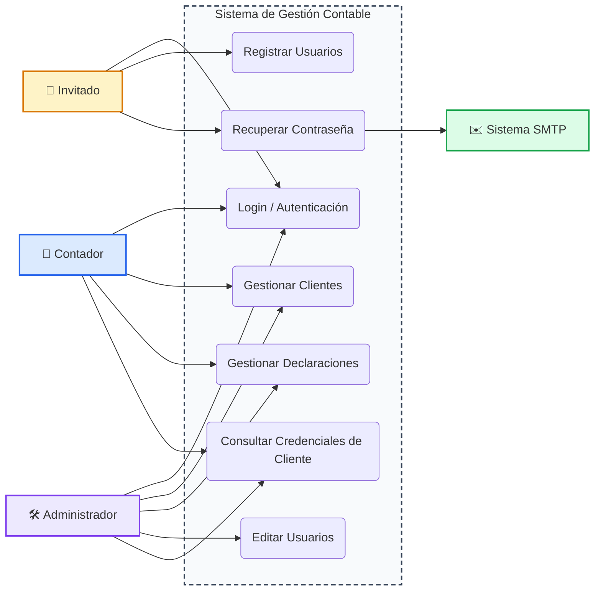

# Caso de Uso General — Sistema de Gestión Contable

## Actores

| Actor | Descripción |
| --- | --- |
| **Administrador** | Usuario con rol `ADMINISTRADOR`. Gestiona usuarios del sistema y accede a todos los módulos. |
| **Contador** | Usuario con rol `CONTADOR`. Gestiona clientes y declaraciones. |
| **Invitado / visitante** | Persona sin sesión: registra cuenta o inicia sesión (login público). |
| **Sistema de correo (SMTP)** | Servicio externo que envía los códigos de recuperación de contraseña. |

## Diagrama de casos de uso

## Matriz actor ↔ caso de uso

| Caso de uso | Administrador | Contador | Invitado |
| --- | --- | --- | --- |
| Login / Autenticación | ✔ | ✔ | ✔ (crear cuenta) |
| Recuperar contraseña | ✔ | ✔ | ✔ |
| Gestionar clientes | ✔ | ✔ | — |
| Gestionar declaraciones | ✔ | ✔ | — |
| Consultar credenciales de cliente | ✔ | ✔ | — |
| Registrar usuarios | ✔ (via POST público) | — | ✔ (registro propio) |
| Editar usuarios | ✔ | — | — |

## Relación con los módulos

- **Autenticación:** emisión y validación de tokens JWT (`JwtAuthenticationFilter` protege todas las rutas menos las públicas).
- **Módulo de usuarios:** CRUD restringido a `ADMINISTRADOR`; registro y recuperación abiertos.
- **Módulo de clientes:** incluye bóveda de credenciales cifradas.
- **Módulo de declaraciones:** upsert mensual por cliente/año/mes/tipo de impuesto.

> Cada caso de uso tiene su ficha detallada en este directorio (`caso-de-uso-login.md`, `caso-de-uso-gestion-clientes.md`, `caso-de-uso-gestion-declaraciones.md`, `caso-de-uso-recuperacion-contrasena.md`).