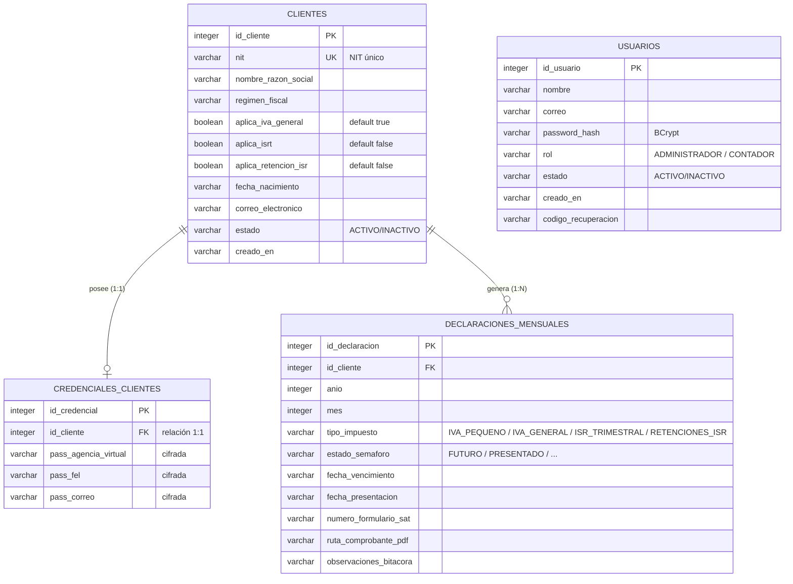

# Diagrama Entidad-Relación (ER)

Modelo de datos del Sistema de Gestión Contable (SQLite). Incluye las cuatro tablas del sistema y sus relaciones.

## Diagrama ER

## Restricciones clave

| Tabla | Restricción |
| --- | --- |
| `clientes` | `nit` `UNIQUE NOT NULL` |
| `credenciales_clientes` | `id_cliente` `UNIQUE` (relación 1:1 con `clientes`) |
| `declaraciones_mensuales` | `UNIQUE (id_cliente, anio, mes, tipo_impuesto)` |
| `usuarios` | Sin restricciones adicionales en la implementación actual |

## Convenciones

- **PK** = clave primaria (`id_<tabla>` con autoincremento).
- **FK** = clave foránea por `id_cliente`.
- Los campos `creado_en` son mantenidos por la base de datos (`insertable = false, updatable = false`).
- Las credenciales del cliente se almacenan **cifradas** (`EncriptacionUtil`); `password_hash` de usuarios se almacena con **BCrypt**.

## Nota de alineación

La base de datos existente (`BD/servicio_contable.db`) puede **no** contener aún las columnas nuevas de las entidades (`aplica_iva_general`, `aplica_isrt`, `aplica_retencion_isr` en `clientes`; `tipo_impuesto` en `declaraciones_mensuales`). Para una base nueva use el script de creación. Para migrar una existente, SQLite exige agregar columnas `NOT NULL` con valor por defecto (ver [script-creacion-bd.md](./script-creacion-bd.md), sección *Migración*).

## Script relacionado

Ver [script-creacion-bd.md](./script-creacion-bd.md) para el DDL completo de creación.