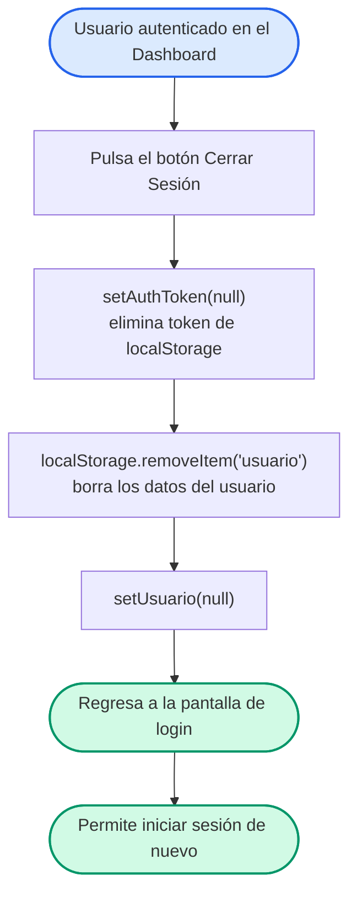

# Diagrama de Flujo — Cierre de Sesión

Flujo para cerrar la sesión del usuario: elimina el token JWT y los datos de sesión del `localStorage` y regresa a la pantalla de login.

## Flujo

## Detalle de decisiones

| Nodo | Lógica implementada |
| --- | --- |
| Cierre de sesión | `App.jsx` (`handleLogout`) llama `setAuthToken(null)`, `localStorage.removeItem('usuario')` y `setUsuario(null)`. |
| Resultado | El interceptor de Axios deja de adjuntar `Authorization: Bearer <token>` porque el token ya no existe en `localStorage`. |
| Pantalla de login | Al quedar `usuario = null`, `App.jsx` renderiza la vista `Auth` (`Login.jsx`). |

## Layout

- Flujo lineal **TD (top-down)**; inicio en azul y fin en verde, coherente con el resto de la documentación.
