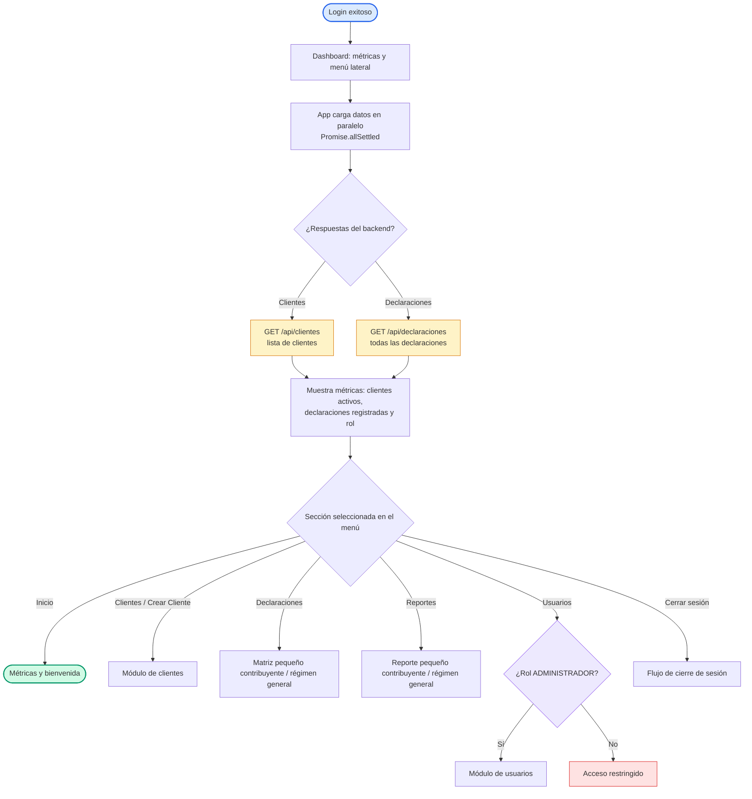

# Diagrama de Flujo — Dashboard y Métricas

Flujo del panel principal: tras autenticarse, la aplicación carga clientes y declaraciones en paralelo, muestra las métricas y expone el menú lateral desde el que se accede a cada módulo del sistema.

## Flujo

## Detalle de decisiones

| Nodo | Lógica implementada |
| --- | --- |
| Carga en paralelo | `App.jsx` usa `Promise.allSettled` sobre `ClientesAPI.obtenerTodos()` y `DeclaracionesAPI.obtenerTodas()` al autenticarse. |
| Métricas | Tarjetas con `clientes.length`, `declaraciones.length` y `usuario.rol`. |
| Secciones del menú | `DashboardLayout` define: Inicio, Clientes, Crear Cliente, Declaraciones (Pequeño/Régimen General), Reportes (Pequeño/Régimen General) y Usuarios (solo administrador). |

## Layout

- Estructura **TD (top-down)**; inicio/fin en azul/verde, persistencia en ámbar, decisión de permisos en morado y error en rojo, coherente con el resto de la documentación.
