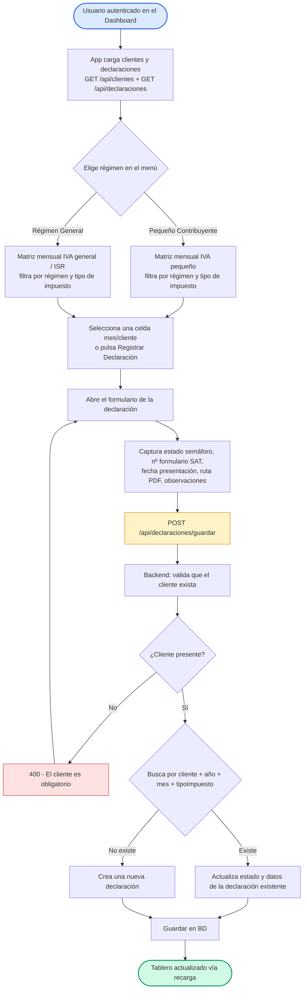

# Diagrama de Flujo — Gestión de Declaraciones

Flujo del módulo de declaraciones mensuales: el contador registra/actualiza el estado de cada declaración por cliente, mes y tipo de impuesto, y consulta un tablero anual por régimen fiscal.

## Flujo

## Detalle de decisiones

| Nodo | Lógica implementada |
| --- | --- |
| Carga de datos | El Dashboard (`App.jsx`) carga clientes y declaraciones en paralelo (`GET /api/clientes` + `GET /api/declaraciones`); las matrices filtran por régimen del cliente y tipo de impuesto en el frontend. |
| Guardado (upsert) | `POST /api/declaraciones/guardar` valida que el cliente exista; luego `findByClienteIdClienteAndAnioAndMesAndTipoImpuesto(...)`: si existe, actualiza (estado, nº formulario, fechas, PDF, bitácora); si no, crea. |
| Tipo de impuesto | Default `IVA_PEQUENO`; valores: `IVA_PEQUENO`, `IVA_GENERAL`, `ISR_TRIMESTRAL`, `RETENCIONES_ISR`. |
| UNIQUE | `(id_cliente, anio, mes, tipo_impuesto)` garantiza una fila por combinación. |
| Semáforo | La matriz pinta la celda según `estadoSemaforo`: `PRESENTADO/PAGADO` = verde, `EN_PROCESO/PENDIENTE_DOCUMENTACION` = amarillo, `OMISO/PENDIENTE` = rojo, período futuro = blanco. |

## Reglas de negocio

- Una misma celda mes/cliente puede alojar declaraciones de **distinto tipo de impuesto**, por eso el `tipo_impuesto` forma parte de la clave de unicidad.
- El `estado_semaforo` (`FUTURO`, `PRESENTADO`, etc.) se actualiza sin duplicar registros (upsert).

## Layout

- Estructura **TD (top-down)** con dos ramas de entrada (regímenes) que convergen en el formulario de guardado.
- Respuestas de error en rojo, acciones de persistencia en ámbar, inicio/fin en azul/verde.
- Sin directivas `%%{init}%%`: el editor (Zed) y las plataformas (GitHub/mermaid.live) aplican su configuración predeterminada.
