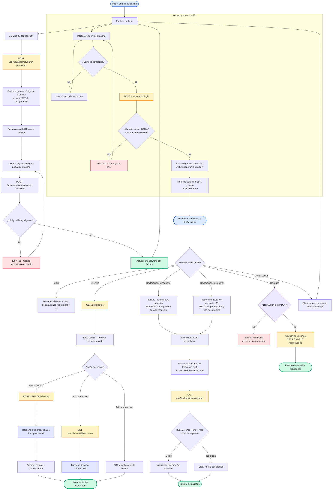

# Diagrama de Flujo — Sistema Completo

Vista general de todo el sistema de Gestión de Clientes y Declaraciones: autenticación (JWT), recuperación de contraseña, tablero principal, gestión de clientes, declaraciones (pequeño contribuyente / régimen general), usuarios (solo administrador) y cierre de sesión.

## Flujo

## Corrección aplicada — migración de esquema

Durante la compilación del backend se detectó que Hibernate no podía aplicar columnas nuevas sobre la base SQLite existente: SQLite **no permite agregar una columna `NOT NULL` sin valor por defecto**, por lo que el `ALTER TABLE` fallaba silenciosamente (solo generaba warnings) y la aplicación fallaba en ejecución con `no such column`.

| Tabla | Columna | Antes | Ahora (con `columnDefinition`) |
| --- | --- | --- | --- |
| `clientes` | `aplica_iva_general` | `boolean not null` | `boolean not null default true` |
| `clientes` | `aplica_isrt` | `boolean not null` | `boolean not null default false` |
| `clientes` | `aplica_retencion_isr` | `boolean not null` | `boolean not null default false` |
| `declaraciones_mensuales` | `tipo_impuesto` | `varchar(255) not null` | `varchar(255) not null default 'IVA_PEQUENO'` |

Este cambio se hizo en las entidades `Cliente.java` y `DeclaracionMensual.java` y quedan reflejadas en el script de creación de la BD (`docs/database/script-creacion-bd.md`). Con esto, `spring.jpa.hibernate.ddl-auto=update` aplica la migración correctamente en cualquier máquina con una BD antigua.

## Detalle de decisiones

| Nodo | Lógica implementada |
| --- | --- |
| Autenticación | `POST /api/usuarios/login` valida credenciales (BCrypt o hash en texto plano migrado) y emite JWT con expiración de 24 h. |
| Recuperación | `recuperar-password` genera código de 6 dígitos + token JWT (15 min) y lo envía por SMTP; `restablecer-password` valida código y token y actualiza el hash. |
| Dashboard | `App.jsx` carga clientes y declaraciones en paralelo (`Promise.allSettled`) al autenticarse. |
| Clientes | Las credenciales se almacenan cifradas; el listado anula los campos cifrados y solo `GET /{id}/accesos` los descifra puntualmente. |
| Declaraciones | Upsert por `cliente + año + mes + tipo_impuesto` (restricción UNIQUE) con semáforo de estado por celda. |
| Usuarios | Solo el rol `ADMINISTRADOR` ve y gestiona el módulo de usuarios; los demás ven "Acceso restringido". |

## Mapas a los diagramas por módulo

| Módulo | Diagrama detallado |
| --- | --- |
| Login | [diagrama-login.md](./diagrama-login.md) |
| Recuperación de contraseña | [diagrama-recuperacion-contrasena.md](./diagrama-recuperacion-contrasena.md) |
| Dashboard / Métricas | [diagrama-dashboard.md](./diagrama-dashboard.md) |
| Gestión de clientes | [diagrama-gestion-clientes.md](./diagrama-gestion-clientes.md) |
| Gestión de declaraciones | [diagrama-declaraciones.md](./diagrama-declaraciones.md) |
| Gestión de usuarios | [diagrama-gestion-usuarios.md](./diagrama-gestion-usuarios.md) |
| Cierre de sesión | [diagrama-cierre-sesion.md](./diagrama-cierre-sesion.md) |

## Layout

- Estructura **TD (top-down)** con `subgraph` para el bloque de acceso; el resto de módulos cuelgan del dashboard vía la decisión de sección.
- Misma paleta semántica del resto de la documentación: inicio/fin en azul/verde, persistencia en ámbar, cifrado en azul, decisión de permisos en morado y errores en rojo.
- Sin directivas `%%{init}%%`: el editor (Zed) y las plataformas (GitHub/mermaid.live) aplican su configuración predeterminada.
