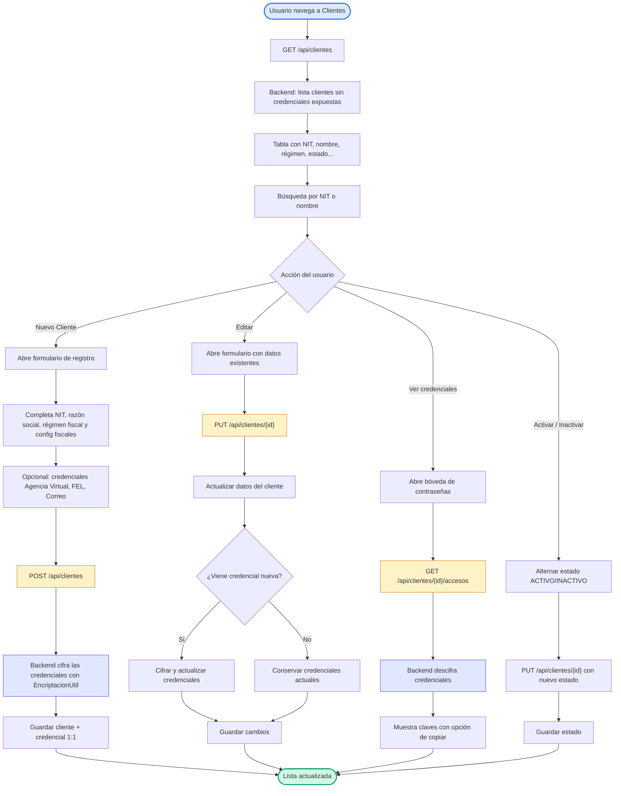

# Diagrama de Flujo — Gestión de Clientes

Flujo del módulo de clientes: listado, registro, edición, cambio de estado y consulta de credenciales (bóveda de contraseñas) con cifrado/descifrado en el backend.

## Flujo

## Detalle de decisiones

| Nodo | Lógica implementada |
| --- | --- |
| Listado | `GET /api/clientes` → `ClienteController.obtenerClientes()` anula las credenciales cifradas en la respuesta para no exponerlas. |
| Registro | `POST /api/clientes` cifra `pass_agencia_virtual`, `pass_fel`, `pass_correo` con `EncriptacionUtil.encriptar(...)` antes de guardar (casacade 1:1 con `CredencialCliente`). |
| Edición | `PUT /api/clientes/{id}` actualiza campos de negocio y **solo** cifra/actualiza credenciales cuando llegan nuevas y no vacías. |
| Estado | Se conmuta `ACTIVO` ↔ `INACTIVO` vía `PUT` enviando el objeto completo con el nuevo estado. |
| Bóveda de credenciales | `GET /api/clientes/{id}/accesos` descifra con `EncriptacionUtil.desencriptar(...)` y devuelve `claveAV`, `claveFEL`, `claveCorreo`. |

## Seguridad del módulo

- Las credenciales de clientes se almacenan cifradas (nunca en texto plano) y solo se descifran de forma puntual en el endpoint de accesos.
- El interceptor de Axios envía el token JWT (`Authorization: Bearer`) en cada petición a `ClientesAPI`.

## Layout

- Flujo de listado **TD (top-down)** con ramas laterales por acción del usuario.
- Las operaciones de cifrado/descifrado se resaltan en azul para distinguirlas de las acciones CRUD (ámbar).
- Sin directivas `%%{init}%%`: el editor (Zed) y las plataformas (GitHub/mermaid.live) aplican su configuración predeterminada.