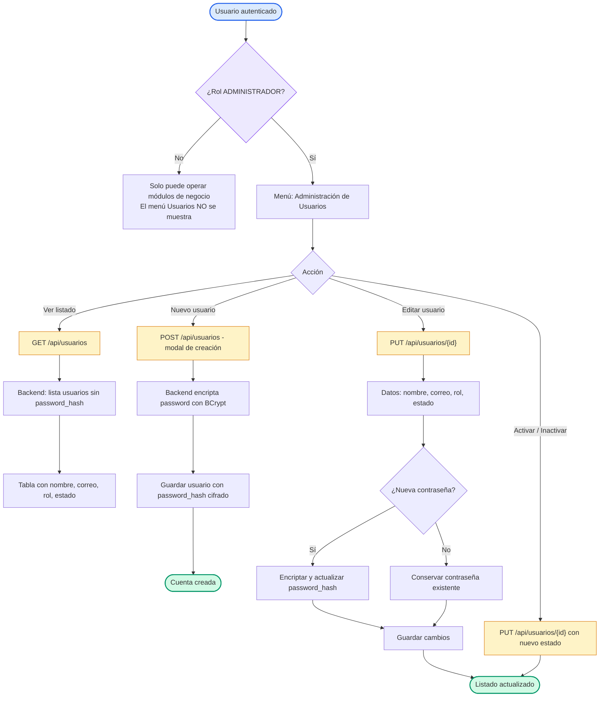

# Diagrama de Flujo — Gestión de Usuarios

Flujo del módulo de administración de usuarios. Incluye la regla de acceso por rol (`ADMINISTRADOR`), el registro de nuevas cuentas y la edición de perfil/rol/estado.

## Flujo

## Reglas de acceso (Spring Security)

| Endpoint | Regla |
| --- | --- |
| `POST /api/usuarios` | `permitAll()` — registro público de cuentas. |
| `POST /api/usuarios/login`, `recuperar-password`, `restablecer-password` | `permitAll()`. |
| `GET /api/usuarios` | Requiere rol `ADMINISTRADOR`. |
| `PUT /api/usuarios/**` | Requiere rol `ADMINISTRADOR`. |
| Resto de endpoints (`/api/clientes`, `/api/declaraciones`) | Autenticados (token JWT válido). |

## Detalle de decisiones

| Nodo | Lógica implementada |
| --- | --- |
| Ocultar menú | `DashboardLayout` condiciona `esAdmin = usuario?.rol === 'ADMINISTRADOR'` para mostrar el item Usuarios. |
| Listado | `GET /api/usuarios` elimina el `passwordHash` de cada objeto antes de responder. |
| Alta por admin | El modal "Nuevo Usuario" (`UsuarioForm`) exige contraseña y la envía a `POST /api/usuarios`; el backend la encripta con `BCryptPasswordEncoder` y asigna rol por defecto `CONTADOR`. |
| Registro público | No pertenece a este módulo: ocurre en la pantalla de login (`Crear Cuenta`) vía `POST /api/usuarios` con rol `CONTADOR`. |
| Edición | `PUT /api/usuarios/{id}` actualiza solo los campos no nulos; encripta la nueva contraseña únicamente si se envía (si no, conserva la actual). |
| Estado | Se conmuta `ACTIVO` ↔ `INACTIVO` enviando el objeto completo con el nuevo estado (`PUT /api/usuarios/{id}`). |

## Layout

- Flujo **TD (top-down)**, la decisión de rol se resalta en morado para distinguirla de las decisiones funcionales.
- Persistencia en ámbar, éxito en verde, inicio en azul, coherente con los demás diagramas.
- Sin directivas `%%{init}%%`: el editor (Zed) y las plataformas (GitHub/mermaid.live) aplican su configuración predeterminada.