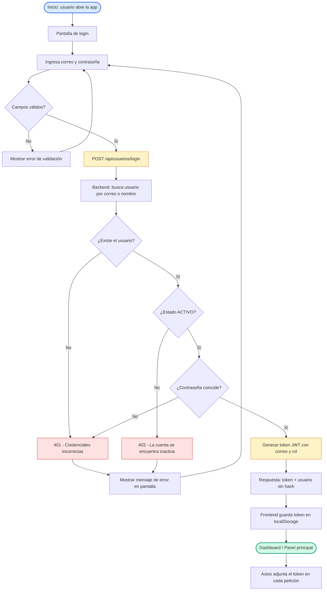

# Diagrama de Flujo — Login / Autenticación

Flujo de autenticación del sistema: el usuario inicia sesión, el backend valida las credenciales y, en caso de éxito, emite un token JWT que el frontend almacena para las peticiones posteriores.

## Flujo

## Detalle de decisiones

| Nodo | Lógica implementada |
| --- | --- |
| Validación de campos | El frontend (`useLogin.js`) exige correo y contraseña no vacíos. |
| Búsqueda del usuario | `UsuarioRepository.findByCorreoOrNombre(...)`; el backend acepta `correo`, `nombre`, `usuario` o `identificador`. |
| Comparación de contraseña | BCrypt si el hash inicia con `$2a$/$2b$/$2y$`; si es texto plano, compara directo y migra a BCrypt. |
| Generación del token | `JwtUtil.generarTokenLogin(correo, rol)` — expiración configurada en `app.jwt.expiracionLoginMs` (24 h por defecto). |
| Almacenamiento del token | `setAuthToken(token)` guarda el token en `localStorage` para que el interceptor de Axios lo envíe como `Authorization: Bearer <token>`. |

## Códigos de respuesta posibles

| Código | Significado |
| --- | --- |
| `200` | Login exitoso: `{ token, usuario }`. |
| `400` | Faltan usuario/correo o contraseña (mensaje `Debe ingresar un usuario/correo y contraseña.`). |
| `401` | Credenciales incorrectas. |
| `403` | La cuenta se encuentra inactiva. |

## Layout

- Dirección del flujo: **TD (top-down)**, ramas secundarias a los lados.
- Sin directivas `%%{init}%%`: el editor (Zed) y las plataformas (GitHub/mermaid.live) aplican su configuración predeterminada.
- Formas: `([redondeada])` = inicio/fin, `{}` = decisión, `[]` = proceso, con colores semánticos (acción = ámbar, error = rojo, inicio/fin = azul/verde).