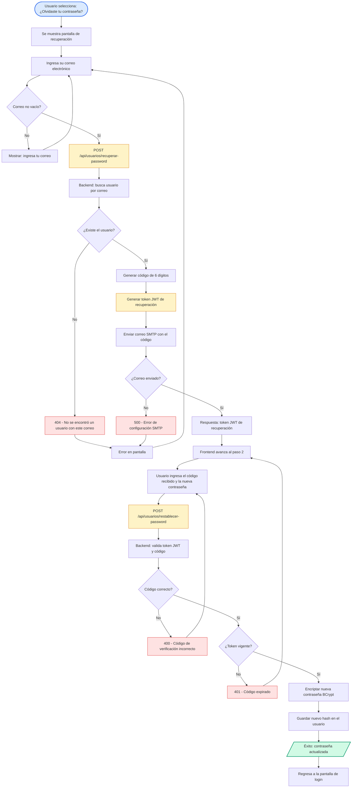

# Diagrama de Flujo — Recuperación de Contraseña

Flujo para restablecer la contraseña de un usuario del sistema mediante un código de verificación de 6 dígitos enviado por correo (servidor SMTP) y un token JWT de corta duración.

## Flujo

## Detalle de decisiones

| Nodo | Lógica implementada |
| --- | --- |
| Búsqueda del correo | `UsuarioRepository.findByCorreo(correo)`. |
| Código de verificación | Aleatorio de 6 dígitos (`Math.random()` entre 100000 y 999999); viaja dentro del token JWT (`claims.codigo`) y como contenido del correo. |
| Token de recuperación | `JwtUtil.generarTokenRecuperacion(correo, codigo)` — expira en `app.jwt.expiracionRecuperacionMs` (15 min por defecto). |
| Envío de correo | `Email.enviarCodigoRecuperacion(...)` vía Gmail SMTP (config en `application.properties`). |
| Restablecimiento | Valida `codigo` contra el JWT y reencadena con `PasswordEncoder.encode(nuevaPassword)`. |

## Códigos de respuesta posibles

| Código | Significado |
| --- | --- |
| `200` | Código enviado / contraseña actualizada. |
| `400` | Faltan parámetros o el código de verificación es incorrecto. |
| `401` | El tiempo del código ha expirado o el token es inválido/alterado. |
| `404` | No se encontró un usuario con ese correo. |
| `500` | Error al enviar el correo (SMTP no configurado). |

## Layout

- Flujo principal **TD (top-down)**; los errores se ramifican a la derecha con color rojo.
- Sin directivas `%%{init}%%`: el editor (Zed) y las plataformas (GitHub/mermaid.live) aplican su configuración predeterminada.
- Misma paleta semántica que el diagrama de login para mantener coherencia visual.