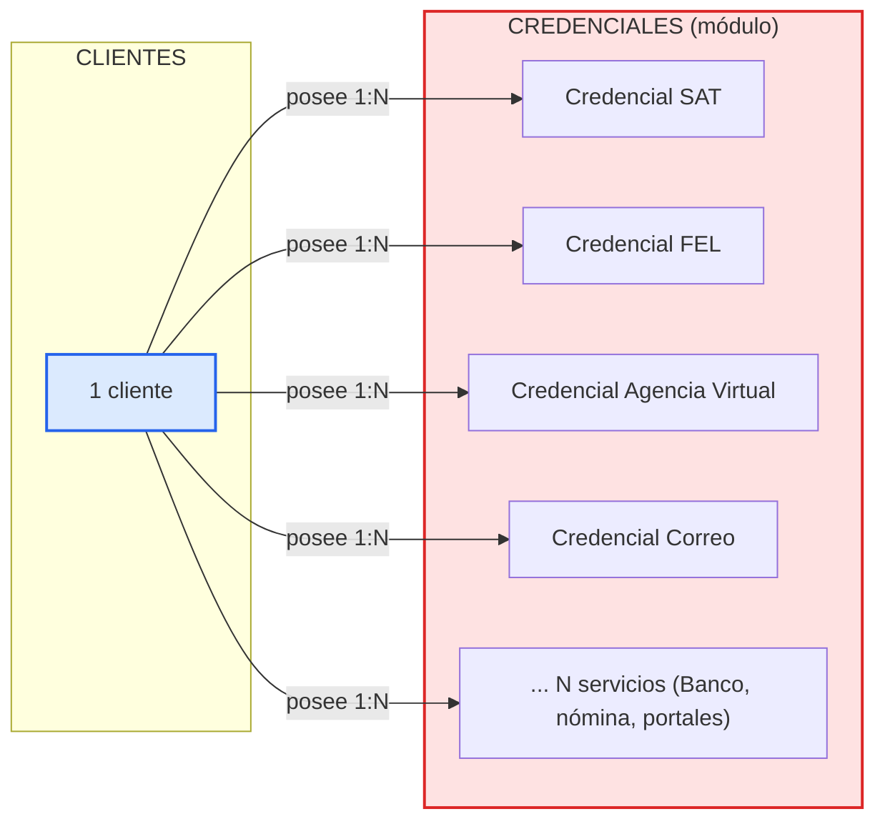

# Fases de Mejora del Sistema

Este documento describe las fases de mejora previstas para el Sistema de Gestión Contable. Se documentan de forma incremental: cada fase describe el estado actual, el objetivo, el diseño propuesto y los criterios de aceptación.

## Estado actual del módulo (resumen)

El sistema modela las credenciales del cliente de forma **rígida y fija**. Hoy existe la entidad `CredencialCliente` (tabla `credenciales_clientes`) con una relación **1:1** con el cliente y exactamente **3 campos fijos**:

| Concepto | Ubicación actual |
| --- | --- |
| Credencial Agencia Virtual (SAT) | Columna `pass_agencia_virtual` |
| Credencial FEL (facturación electrónica) | Columna `pass_fel` |
| Credencial de correo | Columna `pass_correo` |
| Bóveda / consulta | `GET /api/clientes/{id}/accesos` (devuelve `claveAV`, `claveFEL`, `claveCorreo`) |
| Captura en el formulario | `ClienteForm.jsx` — 3 inputs fijos (`claveAV`, `claveFEL`, `claveCorreo`) |
| Despliegue en el modal | `ModalAcceso.jsx` — 3 filas fijas (Agencia Virtual, FEL, Correo) |

> **Limitación:** los 3 campos están "cableados" en el esquema, el backend (`ClienteController`) y el frontend. Si un cliente necesita la credencial de otro servicio (por ejemplo, un usuario del SAT, la banca en línea, un portal tributario local o un proveedor de nómina), hoy exige cambiar la base de datos, el código y desplegar de nuevo. Eso contradice el objetivo del proyecto: tener un cliente que almacene las credenciales de **diferentes páginas y servicios**.

---

## Fase 1 — Módulo de Credenciales por Cliente (paramétrico)

**Objetivo:** convertir la credencial fija actual en un **módulo de credenciales** donde cada cliente pueda tener **N credenciales de distintos servicios/plataformas** (SAT, FEL, Agencia Virtual, correo, banca, portales tributarios, etc.) sin necesidad de cambios de esquema ni de código al agregar un servicio nuevo.

### Problema actual

- **Esquema rígido:** solo 3 columnas fijas; no hay forma de agregar un servicio más sin migrar la BD.
- **Código cableado:** formulario y bóveda repiten los mismos 3 campos/etiquetas.
- **Sin CRUD propio:** las credenciales se gestionan como parte del CRUD del cliente, no como un módulo con ciclo de vida propio.
- **Sin metadatos:** no hay identificador de usuario del servicio, URL de la plataforma, notas ni historial por credencial.

### Diseño propuesto

Modelo **1 cliente → N credenciales**. Cada credencial describe el **servicio** al que pertenece y guarda el secreto cifrado con AES (`EncriptacionUtil`, misma clave configurable por `APP_ENCRYPTION_KEY`).



**Entidad de dominio propuesta — `Credencial`:**

| Campo | Tipo | Descripción |
| --- | --- | --- |
| `id_credencial` | PK | Identificador único. |
| `id_cliente` | FK (1:N) | Cliente dueño de la credencial. |
| `servicio` | varchar | Servicio/plataforma: `SAT`, `FEL`, `Agencia Virtual`, `Correo`, `Banco`, etc. |
| `usuario` | varchar | Usuario/cuenta de acceso en el servicio. |
| `password_cifrada` | varchar | Secreto cifrado con AES (`EncriptacionUtil`). |
| `url` | varchar | Sitio o plataforma (opcional). |
| `notas` | varchar | Notas adicionales (opcional). |
| `creado_en` / `actualizado_en` | timestamp | Historial de auditoría. |

**Catálogo opcional de servicios (`tipos_servicio`):** lista sugerida (`SAT`, `FEL`, `Agencia Virtual`, `Correo electrónico`, `Banca en línea`, `Otro`) para normalización, pero el módulo debe funcionar con `servicio` como texto libre.

### Backend propuesto

Nuevo `CredencialController` con CRUD dedicado:

| Endpoint | Comportamiento |
| --- | --- |
| `GET /api/clientes/{idCliente}/credenciales` | Lista credenciales **sin** contraseñas (solo metadatos + servicio). |
| `GET /api/clientes/{idCliente}/credenciales/{id}` | Devuelve la credencial **descifrada** (bajo demanda, con sesión autenticada). |
| `POST /api/clientes/{idCliente}/credenciales` | Crea credencial cifrando la contraseña recibida. |
| `PUT /api/clientes/{idCliente}/credenciales/{id}` | Actualiza metadatos y/o contraseña (solo si viene no vacía). |
| `DELETE /api/clientes/{idCliente}/credenciales/{id}` | Elimina una credencial. |

**Reglas de seguridad:**
- La contraseña **nunca** se devuelve en el listado; solo en el endpoint individual y bajo demanda.
- Descifrado exclusivo del backend con `EncriptacionUtil`; la clave AES queda en el servidor (`APP_ENCRYPTION_KEY`).
- Operaciones protegidas por el token JWT (toda la API, salvo login/recuperación).
- Las contraseñas se **cifran siempre** al persistir y nunca viajan en texto plano por la API.

### Frontend propuesto

- **Bóveda de credenciales dinámica:** en lugar de 3 filas fijas, el modal (`ModalAcceso`) renderiza la lista de credenciales del cliente por servicio con acciones: mostar/ocultar, copiar, editar y eliminar.
- **Formulario de cliente:** la sección "Bóveda de contraseñas" pasa a una lista editable de credenciales (servicio + usuario + contraseña) que se puede ampliar con "+ Agregar credencial".
- **UX:** copiar al portapapeles, revelar contraseña y aviso de credenciales cifradas, reutilizando `useModalAcceso`.

### Migración propuesta (base de datos)

```sql
-- 1) Nueva tabla generalizada 1:N
CREATE TABLE credenciales (
    id_credencial     INTEGER PRIMARY KEY AUTOINCREMENT,
    id_cliente        BIGINT NOT NULL,
    servicio          VARCHAR(255) NOT NULL,
    usuario           VARCHAR(255),
    password_cifrada  VARCHAR(255),
    url               VARCHAR(255),
    notas             VARCHAR(255),
    creado_en         TIMESTAMP DEFAULT CURRENT_TIMESTAMP,
    actualizado_en    TIMESTAMP DEFAULT CURRENT_TIMESTAMP,
    FOREIGN KEY (id_cliente) REFERENCES clientes (id_cliente)
);
CREATE INDEX idx_credenciales_cliente ON credenciales (id_cliente);

-- 2) Migrar las credenciales existentes como filas (los valores ya vienen cifrados en AES)
INSERT INTO credenciales (id_cliente, servicio, password_cifrada)
SELECT id_cliente, 'Agencia Virtual', pass_agencia_virtual FROM credenciales_clientes
WHERE pass_agencia_virtual IS NOT NULL AND pass_agencia_virtual <> '';

INSERT INTO credenciales (id_cliente, servicio, password_cifrada)
SELECT id_cliente, 'FEL', pass_fel FROM credenciales_clientes
WHERE pass_fel IS NOT NULL AND pass_fel <> '';

INSERT INTO credenciales (id_cliente, servicio, password_cifrada)
SELECT id_cliente, 'Correo', pass_correo FROM credenciales_clientes
WHERE pass_correo IS NOT NULL AND pass_correo <> '';

-- 3) Eliminar la tabla vieja (después de verificar la migración)
-- DROP TABLE credenciales_clientes;
```

### Cambios de código derivados

- Eliminar la entidad `CredencialCliente` (o dejar de usarla) y crear `Credencial` + `CredencialRepository`.
- `ClienteController`: retirar el manejo fijo (encriptar/desencriptar 3 campos) y delegar en el `CredencialController`; quitar el endpoint `/accesos` fijo.
- `ClienteForm.jsx`, `ModalAcceso.jsx` y `useModalAcceso.js`: pasar a listas dinámicas.
- `axiosConfig.js`: nuevos métodos `CredencialesAPI` alineados al CRUD.

### Criterios de aceptación

- [x] Un cliente puede tener **más de 3 credenciales** y de **servicios arbitrarios** sin cambios de código ni de esquema.
- [x] Agregar un servicio como SAT, banca o nómina se registra como un dato (`servicio`), no como columna.
- [x] El listado de credenciales **nunca** expone contraseñas (cifradas ni descifradas).
- [x] El descifrado ocurre solo bajo demanda, en el backend, con sesión autenticada.
- [x] La migración conserva las credenciales vigentes (Agencia Virtual, FEL, Correo) con el mismo exacto.
- [x] Existe CRUD propio (crear, listar, ver, editar, eliminar) por credencial.
- [x] La bóveda del frontend es dinámica para N credenciales.

---

## Próximas fases (borrador)

| Fase | Descripción | Estado |
| --- | --- | --- |
| Fase 1 | Módulo de credenciales por cliente (paramétrico) | Implementada |
| Fase 2 | *(pendiente de definir)* | — |

> Nota de implementación de la Fase 1 (agregada posteriormente): se creó la entidad `Credencial` (tabla `credenciales`, 1:N), el `CredencialController` con CRUD bajo `/api/clientes/{idCliente}/credenciales`, el `CredencialDTO`, y una migración idempotente (`MigracionCredenciales`) que copia los datos de `credenciales_clientes`. En el frontend, `ClienteForm` ya no captura contraseñas y `ModalAcceso` quedó como bóveda dinámica con crear/ver/editar/eliminar. La entidad `CredencialCliente` y el endpoint `/accesos` fueron retirados.

> Este listado se irá completando conforme se definan nuevas mejoras.